# Paw-Pact

## Overview 
The aim of the website is to promote a new dog rescue shelter opening in Galway city. The mission
is to provide safety and security to vunerable dogs that have been neglected, abandonded, abused, or 
surrendered. We want to care for these dogs, while also trying to find them new homes. Helping them by retraining, and rehabilitaion. The end goal is to give each dog thier new forever home, and see them thrive.

This was a solo project built using only HTML, CSS, and Bootstrap. It focuses on clean UI, accessibility, and responsiveness for various screen sizes.

Link to deployed site: [Paw-Pact](https://dmolloy.github.io/paw-pact/)

## User Experience Design

The site was designed with the idea of having a clean and clear user experience. The site needed to present the information clearly, and be responsive to users no matter what device they were using.

There are three pages, each with it's own purpose. This was to help keep things clear on each page and avoid any unnecessary clutter. There are links to each page on the navigation bar.

The footer contains a map and address to the shelter. There is also a contact from for getting in touch with the shelter. After completing the form, users are brought to a success page, to let them know the form was sucessfully submitted. With a link to return home. 

### Colour Scheme

The site uses colours that help give a feeling of calmness and warmth. https://colorkit.co/ was used to help find the right colours that would convey the right message. https://webaim.org/ was used to help compare the contrasts of the colours selected to ensure readability throughout the site.

Colour palette 

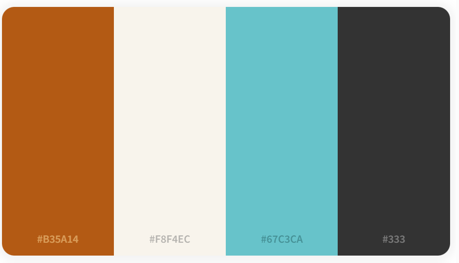

### Typography

Google Fonts and Font Awesome libraries were used for this site. The "Nunito" font was used for all text elements of the site.

### Imagery 

All imagery for this site was sourced from https://pixabay.com/. This was to ensure all images had a certain level of quality and the images were all a consistant in size.

## Features

### Existing Features 

* Landing Page
This is the page that users first see when arriving to our site. The hero image shows a happy dog and our slogan, "A promise to every paw", conveying what we are doing. Making promises to care for dogs.

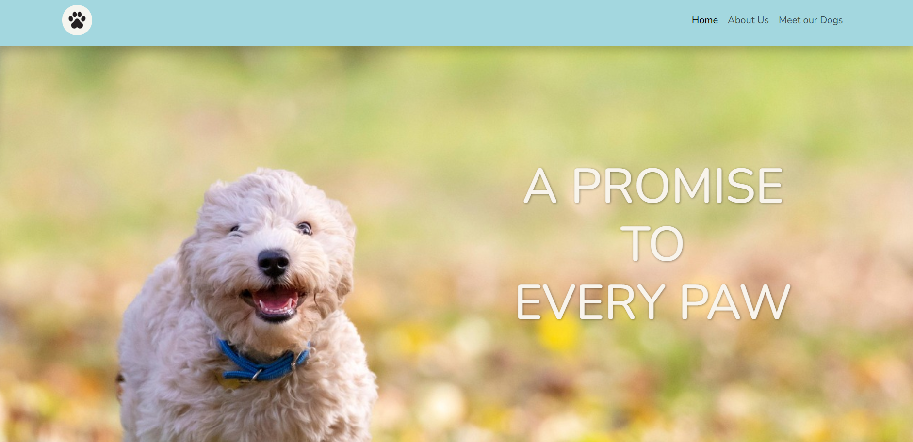

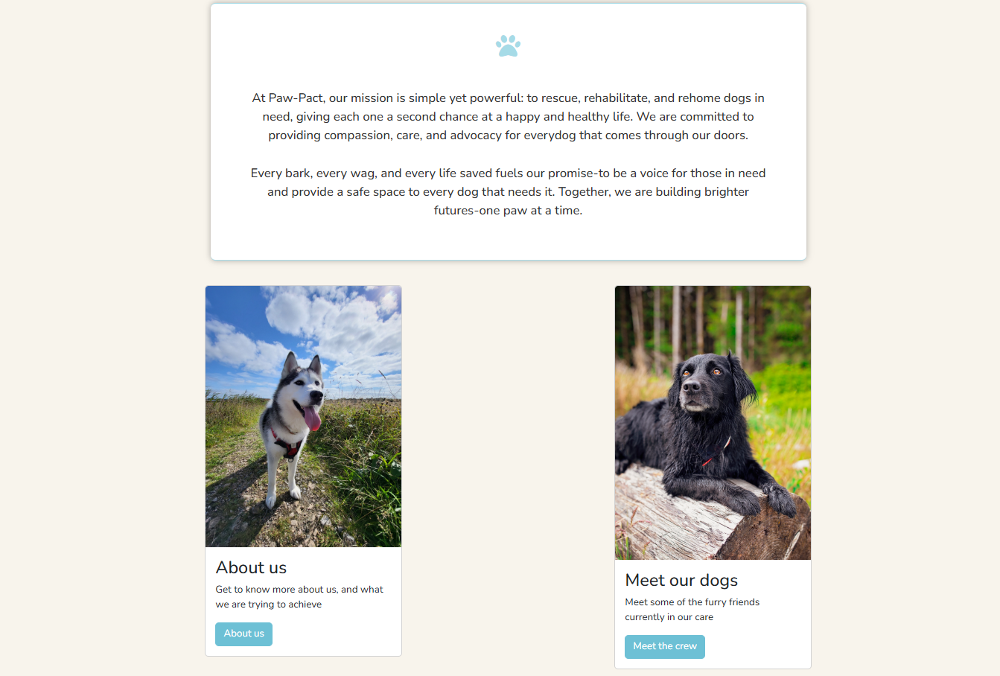

* About Us
This page is to provide more dtails about the charity. It's roots, and expanding on what was said in the mission statement as shown on the home page. There is also a carousel which cycles through images of dogs in shelters and rescue centers. 

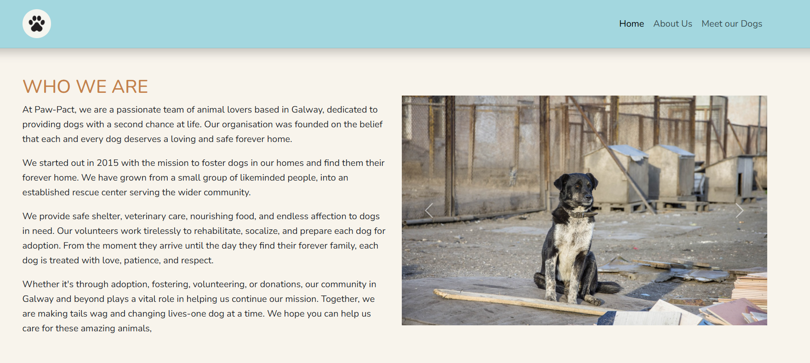

* Meet our dogs
This page is dedicated to showing the dogs that are currently in the care of the shelter. There is a statement at the top of the page that gives a heartfelt message about our dogs, and encourages people to find out more about them. With a picture and a breif profile for each of the dogs. This is for the users to get to know the dogs and think about which one they might like to adopt.

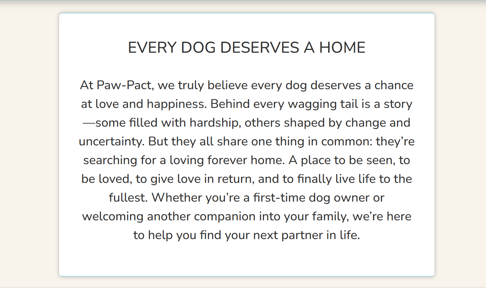

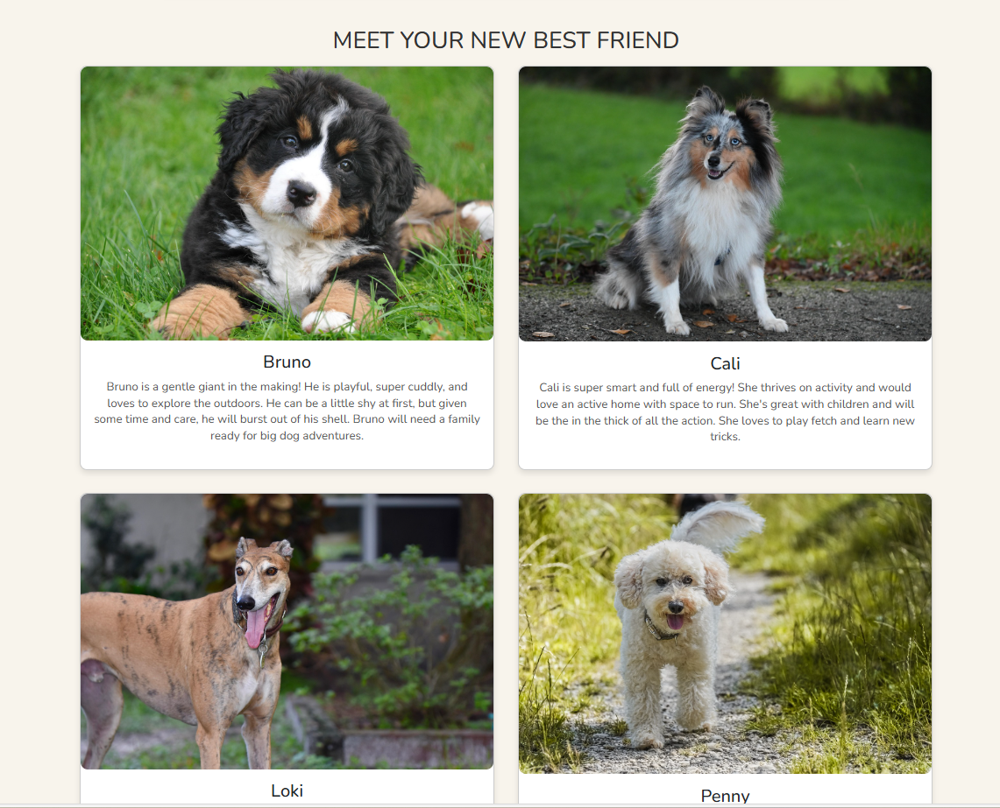

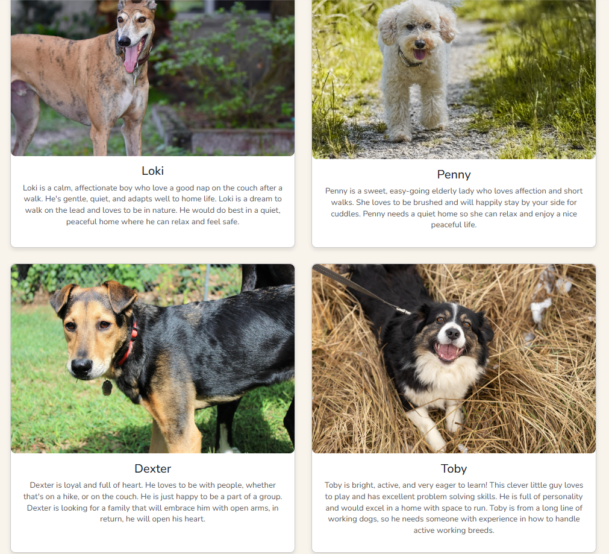

* Footer

The footer is the same for each of the pages. It provides the address of the shelter, a google map interactive element, a contact form, and links to the social media accounts. This makes it very easy for users to always be able to find the address for our shelter, and also make contact with us for any reason.

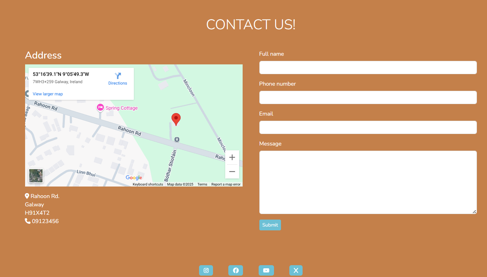

* Confirmation page
This is a conformation page that is presented to the user after sucessfully filling out the contact form. This shows the user that everything was submitted. There is a link to return to the homepage manually. 

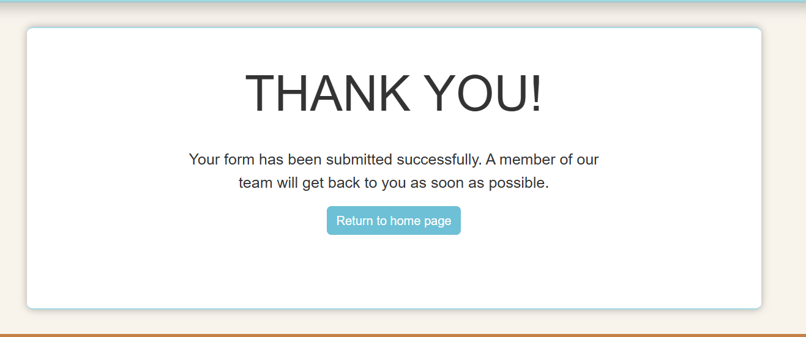

### Future Features

* Donation section 
This will be a section where users are able to make donations to the shelter in the currency of their choosing. For people who can't adopt a dog, but still want to help.

* Shop
A shop will be added to help build fund the shelter. Merchandise with the shelters logo and colours, such as t-shirts, calenders, hats, etc.

## Tools and Technologies Used

### Languages Used

* [HTML](https://en.wikipedia.org/wiki/HTML) - Used for the main site content.
* [CSS](https://en.wikipedia.org/wiki/CSS) - Used for the main site design and layout.

### Development Tools

* [Google Dev Tools](https://developer.chrome.com/docs/devtools/) - Used for troubleshooting, testing responsiveness, and styling.
* [GitHub](https://github.com/) - Used to save and store the project files.
* [Gitpod](https://gitpod.io/workspaces) - used as a cloud-based IDE for development.
* [Git](https://git-scm.com/) - used for version control. (git add, git commit, git push)
* [Bootstrap](https://getbootstrap.com) - Used for styling.

### Fonts and Icons

* [Google Fonts](https://fonts.google.com/) - Imported fonts used throughout the website.
* [Font Awesome](https://fontawesome.com/) - Provided icons for website.

### Image and Color Resources

* [Canva](https://www.canva.com/) - Used for creating logo and favicon images.
* [ColorKit](https://colorkit.co/) - Used to create the color palette.
* [WebAIM](https://webaim.org/) - Used to check color contrast for accessibility purposes.

## Deployment 

The site was deployed to GitHub Pages. The steps to deploy are as follows:

* In the [GitHub repository](https://github.com/Dmolloy/paw-pact), navigate to the Settings tab.
* From the source section drop-down menu, select the Main Branch, then click "Save".
* The page will be automatically refreshed with a detailed ribbon display to indicate the successful deployment.

### Locatl Deployment

This project can be cloned or forked in order to make a local copy on your own system.

### Cloning

You can clone the repository by following these steps:

1. Go to the [GitHub repository](https://github.com/Dmolloy/paw-pact).
2. Locate the Code button above the list of files and click it.
3. Select if you prefer to clone using HTTPS, SSH, or GitHub CLI and click the copy button to copy the URL to your clipboard.
4. Open Git Bash or Terminal.
5. Change the current working directory to the one where you want the cloned directory.
6. In your IDE Terminal, type the following command to clone my repository:
* git clone https://github.com/Dmolloy/paw-pact.git
7. Press Enter to create your local Clone.

### Forking

By forking the GitHub Repository, we make a copy of the original repository on our GitHub account to view and/or make changes without affecting the original owner's repository. You can fork this repository by using the following steps:

1. Log in to GitHub and locate the [GitHub Repository](https://github.com/Dmolloy/paw-pact).
2. At the top of the Repository (not top of page) just above the "Settings" Button on the menu, locate the "Fork" Button.
3. Once clicked, you should now have a copy of the original repository in your own GitHub account!

## Testing

Testing was carried out on each of the pages on my site with W3C Markup Validator and W3C CSS Validator to ensure there were no issues with the syntax in the project.

* Home page 
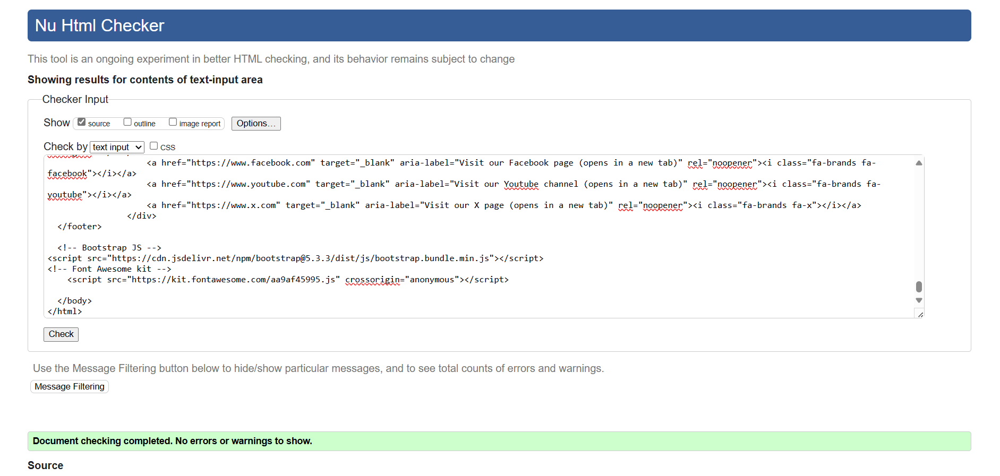

* About-Us Page
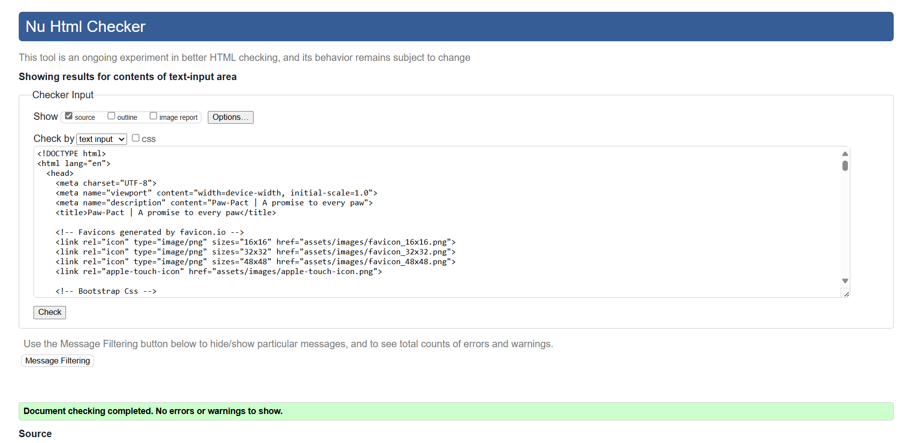

* Meet the Dogs Page
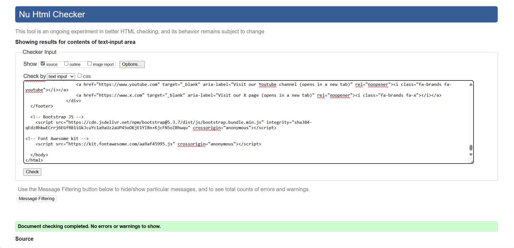

* Success Page
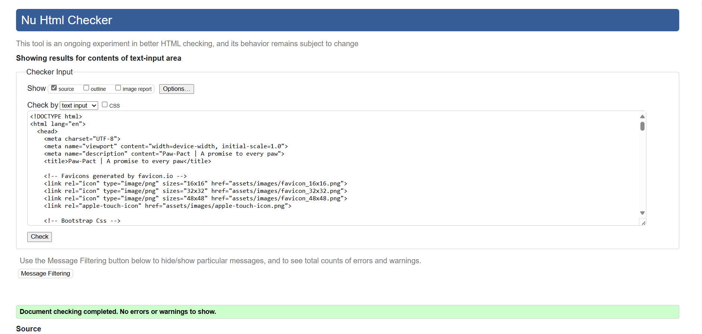

* CSS 
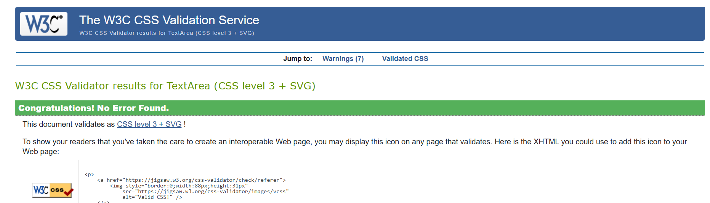

Testing was also carried out on different browsers (Chrome, Safari, Firefox, Edge) and on mobile and tablet devices. 

There are currently no known bugs that have to be fixed.

## Credits 

### Content

* [Bootstrap](https://getbootstrap.com/) - For styling.
* [Stack Overflow](https://stackoverflow.com/questions) - For help with learning proper syntax and troubleshooting tips
* [Code Institute](https://codeinstitute.net/) - Love Running and Boardwalk Games walkthrough projects.
* [W3Schools](https://www.w3schools.com/) - For lessons and learning.
* [Pixabay](https://pixabay.com/) - All images used on the site were sourced from here.

## Acknowledgements

I would like to thank [Code Institue](https://codeinstitute.net/) for the opportunity to take part in this course and give me the tools to help me dive into the world of coding!
The [Slack Community](https://app.slack.com/client/T0L30B202/C01DS0WAHLP) for giving so much advise and always helping me stay motivated during the challenging times.